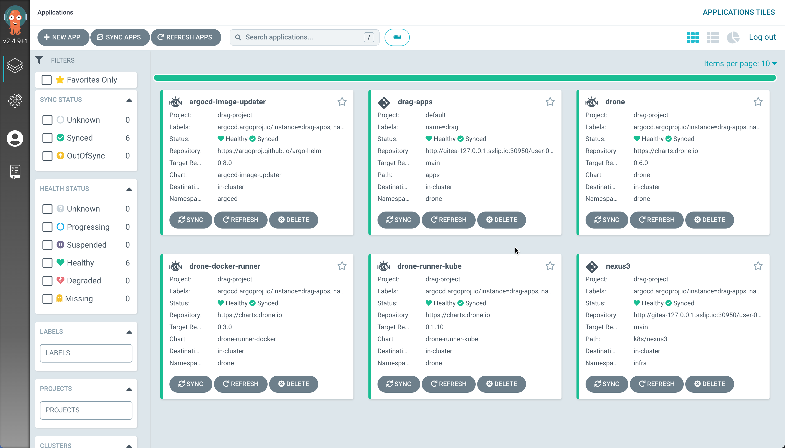

# DroneCI Registry ArgoCD Git (DRAG) Stack

A demo to demonstrate on how to setup [Drone](https://drone.io), with any Container Registry, [ArgoCD](https://argo-cd.readthedocs.io/) and [Gitea](https://gitea.io/) with [k3d](k3d.io/) as your local **[k3s](https://k3s.io)** based Kubernetes Cluster

This demo also shows how to use the Argo CD [declarative setup](https://argo-cd.readthedocs.io/en/stable/operator-manual/declarative-setup/) to setup [Drone](https://drone.io) with Drone Kubernetes runner.

The stack also deploys [ArgoCD Image Updater](https://argocd-image-updater.readthedocs.io/en/stable) to enable updating the application images via GitOps.

## Required Tools

- [Docker Desktop](https://www.docker.com/products/docker-desktop/)
- [k3d](https://k3d.io/)
- [Helm](https://helm.sh/)
- [Kustomize](https://kustomize.io/)
- [httpie](https://httpie.io/)
- [envsusbst](https://www.man7.org/linux/man-pages/man1/envsubst.1.html)

All linux distributions adds **envsubst** via [gettext](https://www.gnu.org/software/gettext/) package. On macOS it can be installed using [Homebrew](https://brew.sh/) like `brew install gettext`.

- [Argo CD CLI](https://github.com/argoproj/argo-cd/releases/latest)
- [direnv](https://direnv.net/)
- [yq](https://github.com/mikefarah/yq)
- [jq](https://stedolan.github.io/jq/)
- [stern](https://github.com/wercker/stern)

## Cluster Bootstrapping

The cluster bootstrapping  that we did in earlier step installs the core DRAG stack applications ([App of Apps](https://argo-cd.readthedocs.io/en/stable/operator-manual/declarative-setup/#app-of-apps)) and DRAG stack has the following child applications,

- Argo CD Image Updater
- Drone Server
- Droner Runners
- Nexus3 Maven Repository Manager and Container Registry

A successful ArgoCD Deployment of DRAG should look like,

### Do some GitOps

Add your projects or the try the ones below and keep rocking with Drone CI and Argo CD.

Few applications that you can try with this stack,

- <https://github.com/kameshsampath/quarkus-springboot-demo-gitops>
- <https://github.com/kameshsampath/lingua-greeter-gitops>
